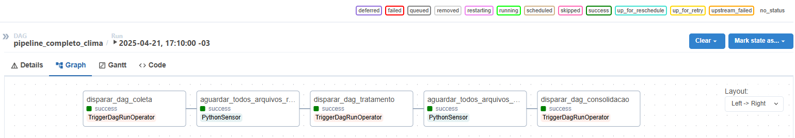
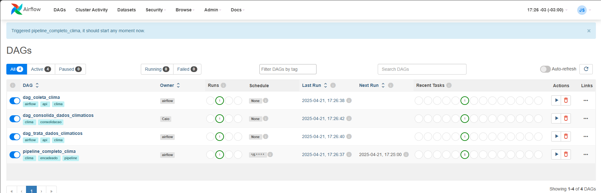

# 🌤️ Projeto 02 - Pipeline de Coleta e Processamento de Dados Climáticos com Airflow + Docker

<br>

## 📌 Visão Geral
Este projeto foi desenvolvido com o objetivo de **aprender e aplicar na prática duas ferramentas amplamente utilizadas no mercado de Engenharia de Dados: o `Apache Airflow` e o `Docker`**.

O Projeto não ignora a construção de um pipeline real — pelo contrário: **foi criado um fluxo completo de ingestão, tratamento e consolidação de dados climáticos via API pública**, com múltiplas etapas encadeadas, apesar de simples. 

No entanto, **o foco principal foi o aprofundamento no uso do Docker e, principalmente, do Airflow**, testando sensores, operadores, DAGs compostas e práticas comuns de orquestração. 

Esse projeto representou **um mergulho prático no universo dessas ferramentas**, indo além do básico e simulando desafios reais.

<br><br>

## 🚀 Tecnologias Utilizadas
- `Apache Airflow`: orquestração das tarefas com DAGs, operadores, sensores e encadeamento de processos.

- `Docker`: containerização completa do ambiente de orquestração com PostgreSQL e Airflow Webserver.

- `API Open-Meteo`: coleta de dados climáticos em tempo real via requisições HTTP.

- `Python`: linguagem base para scripts de coleta, tratamento e consolidação de dados.

- `Pandas`: utilizado para manipulação, tratamento e consolidação dos dados em .parquet.

- `Git + GitHub`: controle de versão e documentação do projeto.

<br><br>

## 📂 Estrutura do Projeto

```
├── dags/                           # DAGs do Airflow
│   ├── dag_coleta_clima.py
│   ├── dag_tratamento.py
│   ├── dag_consolidacao.py
│   └── pipeline_completo_clima.py
│
├── src/                            # Scripts auxiliares (coleta, tratamento, consolidação)
│   ├── coleta/
│   │   ├── cidades/                # Arquivo JSON com cidades que serão coletadas
│   │   │   └── cidades.json
│   │   └── coleta_api.py
│   └── processamento/
│       ├── tratamento.py
│       └── consolidacao.py
│
├── data/                           # Dados gerados
│   ├── raw/                        # Arquivos brutos coletados da API
│   ├── processed/                  # Arquivos tratados
│   └── final/                      # Arquivo final consolidado
│
├── docker/                         # Arquivos de configuração Docker
│   └── docker-compose.yaml
│
├── .env                            # Variáveis de ambiente (API, parâmetros etc.)
├── requirements.txt                # Dependências do projeto
└── README.md                       # Documentação do projeto
```

<br><br>

## ⚙️ Como Executar o Projeto Localmente
Para rodar este projeto localmente, siga os passos abaixo:

### 1. Clone o repositório no seu VSCode via Terminal
```
git clone https://github.com/Cavalheiro93/pipeline-clima-docker-airflow.git

cd pipeline-clima-docker-airflow
```

<br>

### 2. Crie o arquivo `.env`
>📄 **.env**  
_Arquivo com variáveis de ambiente utilizadas no projeto, como a URL base da API climática e os parâmetros desejados (ex: `temperature_2m`)._

Na raiz do projeto, crie um arquivo `.env` com o seguinte conteúdo:
```
API_BASE_URL=https://api.open-meteo.com/v1/forecast
PARAMETROS=temperature_2m
```

<br>

### 3. Navegue até a pasta `docker/`
Certifique-se de ter o Docker instalado. Depois, navegue até a pasta `docker/`:

```
cd docker
```

<br>

### 4. Crie um usuário no Airflow e Inicialize o banco de dados 
Antes de subir os containers principais, execute os seguintes comandos para:
- Criar um usuário administrador para acessar a interface Web
- Inicializar o banco de dados do Airflow

```
docker compose run airflow-webserver airflow users create \
  --username airflow \
  --password airflow \
  --firstname <seu-nome> \
  --lastname <seu-sobrenome> \
  --role Admin \
  --email <seu-email>
```
```
docker compose run airflow-webserver airflow db init
```

>🔁 _Substitua os campos entre `<>` pelas suas informações pessoais.   
Por exemplo: --firstname Joao, --email joao@gmail.com_

> 🧠 _Dica: No projeto, criamos o usuário com username `airflow` e senha `airflow` por simplicidade.  
Use essas credenciais para acessar o Airflow em http://localhost:8080 posteriormente._

<br>

### 5. Suba os serviços principais (Webserver + Scheduler)
Agora sim, suba os containers do Airflow:
```
docker compose up airflow-webserver airflow-scheduler
```
> 🧠 _Dica: Para encerrar o Docker, no Terminal use o CTRL+C para interromper_

💡 Se preferir que os containers rodem em segundo plano (sem travar o terminal), adicione a flag `-d` no final do comando:
```
docker compose up -d airflow-webserver airflow-scheduler
```

<br>

### 6. Verifique se tudo está funcionando corretamente
Se os passos anteriores foram seguidos com sucesso, acesse a interface web do Airflow pelo navegador:

🌐 http://localhost:8080


<p align="center">
  
  
</p>

<br><br>

## ⚙️ Como o Projeto Funciona (Visão Técnica)
Este projeto simula um pipeline de dados completo, automatizado com o Apache Airflow e executado dentro de containers Docker. Abaixo está o fluxo técnico da solução:

### ↕️ Fluxo Geral
#### **Coleta de Dados Climáticos**
Responsável por consumir a API pública com base nas cidades configuradas em *cidades.json*.

📂 Arquivo principal: `src/coleta/coleta_api.py`  
📂 Cidades: `src/coleta/cidades/cidades.json`

#### **Tratamento dos Dados**
Realiza a limpeza, organização e transformação dos dados coletados, gerando arquivos no formato *.parquet*.

📂 Script: `src/processamento/tratamento.py`

#### **Consolidação dos Dados**

Une todos os dados tratados em um único DataFrame e gera um arquivo final consolidado.

📂 Script: `src/processamento/consolidacao.py`

#### **Orquestração com Airflow**
Todas as etapas são controladas por DAGs que garantem a execução sequencial correta, com sensores monitorando a presença dos arquivos.

📂 DAG: `dags/dag_coleta_clima.py`

📂 DAG: `dags/dag_tratamento.py`

📂 DAG: `dags/dag_consolidacao.py`

📂 DAG: `dags/pipeline_completo_clima.py`

<br><br>

##  DAG pipeline_completo_clima.py 

Essa é a DAG que integra todo o pipeline, conectando as três etapas principais: coleta, tratamento e consolidação dos dados climáticos.

### ↕️ Fluxo da DAG



### ⚙️ Ferramentas do Airflow utilizadas:
`TriggerDagRunOperator`: utilizado para acionar as outras DAGs (coleta, tratamento, consolidação).

`PythonSensor`: responsável por aguardar a presença dos arquivos antes de seguir para a próxima etapa.

`Encadeamento com >>`: garante a ordem de execução correta.

`schedule_interval`: A DAG passa a ser executada automaticamente via UI do Airflow, configurada para rodar a cada 5 minutos.

<br><br>

## Resultado Final

Com todas as DAGs ativadas no Toggle Button, a `pipeline_completo_clima` será executada automaticamente, orquestrando as etapas de coleta, tratamento e consolidação conforme a ordem definida.

Se tudo ocorrer corretamente, na interface do Airflow (aba "Recent Tasks") você verá os círculos das tarefas marcados em verde ✅, indicando sucesso na execução.




Após a execução, os arquivos serão gerados nas seguintes pastas:


O arquivo `dados_consolidados.parquet` representa a junção final dos dados de todas as cidades em um único dataset, pronto para análises ou visualizações futuras.
